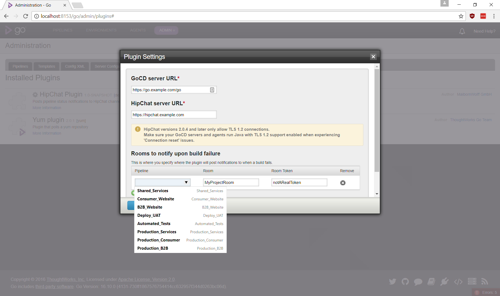
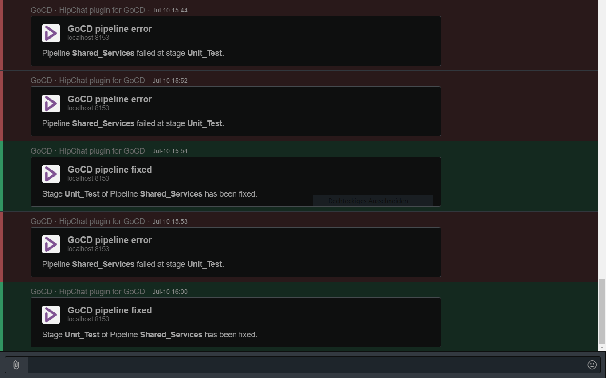

# HipChat integration for GoCD

This Plugin for GoCD enables notifications to be posted on HipChat.

## Features 

* Get notified when any stage in your pipeline fails.
* Configure a separate room for each pipeline.
* Get notified when someone fixed a failing build.

## Screenshots

### Plugin configuration



### Notifications



## Building and testing

To start GoCD inside a Vagrant VM run `make server`.
run `make deploy` to deploy the plugin to the VM.

## License

```plain
 Copyright 2016 MaibornWolff GmbH (HipChat integration)
 Copyright 2016 ThoughtWorks, Inc. (Template)

Licensed under the Apache License, Version 2.0 (the "License");
you may not use this file except in compliance with the License.
You may obtain a copy of the License at

    http://www.apache.org/licenses/LICENSE-2.0

Unless required by applicable law or agreed to in writing, software
distributed under the License is distributed on an "AS IS" BASIS,
WITHOUT WARRANTIES OR CONDITIONS OF ANY KIND, either express or implied.
See the License for the specific language governing permissions and
limitations under the License.
```
